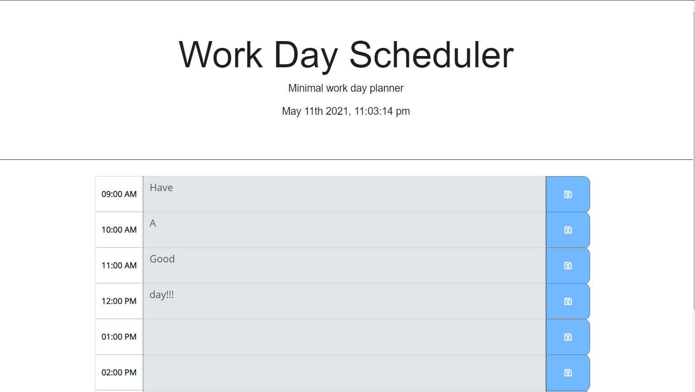

# Work-Day-Scheduler   

## Description
Work day scheduler is a planner with a minimal design for when you just need to set goals and get going. the app will save your entries and color code your past current and upcoming tasks.

## Table of Contents

* [Installation](#installation)
* [Usage](#usage)
* [Credits](#credits)
* [License](#license)
* [Contributing](#contributing)
* [Tests](#tests)
* [Questions](#questions)

## Installation

The app is deployed at the link below.

https://amado-bot.github.io/Work-Day-Scheduler/

## Usage

use this for your busy days, set goals and get things DONE!!!

## Credits

Amado Gutierres

## License
NONE

## Contributing

none

## Tests

none

## Questions

https://github.com/Amado-bot

amadocardenas0@gmail.com
